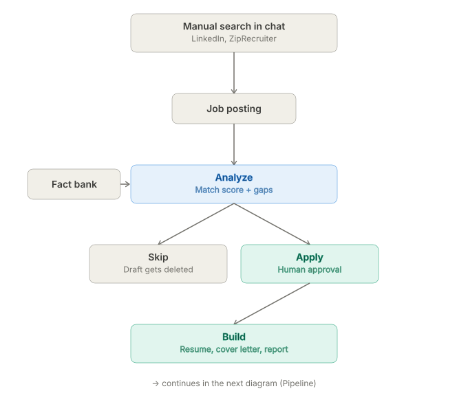
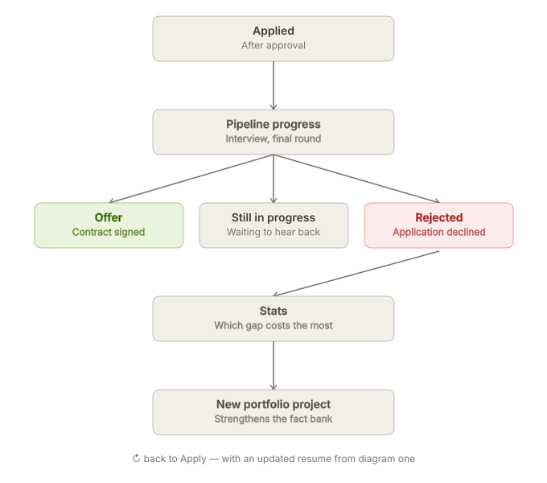

# Workflow diagrams

The full job-search cycle this app automates, in two parts. English and Persian (fa) versions are identical in structure.

## Part 1 — search to build

A manual search finds a job posting. `Analyze` reads that posting together with the fact bank to produce a match score and gaps. A human decision (skip or apply) follows, ending in a built resume and cover letter.

## Part 2 — pipeline to outcome, and back

From `Applied`, through pipeline progress, to one of three outcomes — offer, still in progress, or rejected. Rejections feed `Stats`, which surfaces the gap costing the most interviews. That gap becomes a new portfolio project, which strengthens the fact bank — closing the loop back into `Apply` with a stronger resume.
